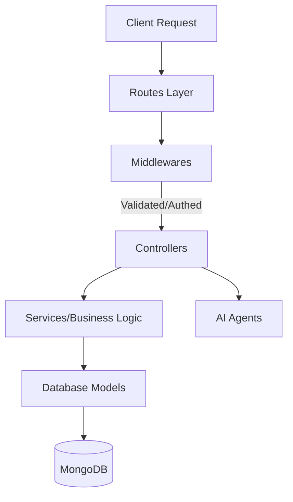

# Global Architecture & Component Map

This document serves as the global architectural map for the `staffwise-project-manager/server` application. It defines the responsibilities of each directory, the expected flow of data, and how the components interact. 

## High-Level Data Flow

The backend follows a strict layered architecture pattern. Data must flow sequentially through these layers. Skipping layers (e.g., a Route directly calling a Model) is an architectural violation.

---

## Directory Intent & Responsibilities

### 1. `/src/routes` (The API Gateway)
**Intent:** Defines the API surface area. 
**Responsibility:** Maps specific URL paths (e.g., `/api/v1/auth/login`) to the corresponding middleware chain and finally the controller. 
**Rules:** 
- Routes must contain ZERO business logic. They only handle HTTP method mapping.
- All mutating endpoints (POST, PUT, PATCH, DELETE) MUST be protected by `auth.middleware.ts` unless explicitly public (like login/register).
- Routes must pass request data to the appropriate Controller without modifying it.

### 2. `/src/validators` (The Schema Guards)
**Intent:** Ensures structural integrity of incoming data.
**Responsibility:** Defines strict schemas (usually Zod or Joi) for request bodies, query params, and URLs.
**Interaction:** Used by `validate.middleware.ts` before the request ever reaches a controller.

### 3. `/src/middlewares` (The Gatekeepers)
**Intent:** Cross-cutting concerns that apply globally or to groups of routes.
**Responsibility:** 
- `auth.middleware.ts`: Verifies JWT tokens and attaches `req.user`.
- `rbac.middleware.ts`: Verifies Role-Based Access Control (Admin vs Employee).
- `validate.middleware.ts`: Executes the validators.
**Rules:** 
- Controllers must assume that if a middleware is attached to their route, the data is safe and the user is authenticated. 
- Controllers must NOT manually check for null properties on `req.user` if the route is protected.

### 4. `/src/controllers` (The Traffic Cops)
**Intent:** Manages the HTTP Request/Response lifecycle.
**Responsibility:** Extracts data from `req`, passes it to a Service or Agent, waits for the result, and formats the JSON response via `res`.
**Rules:** 
- Controllers must NOT contain complex business logic or complex database aggregation pipelines. 
- Every controller function MUST be wrapped in a `try/catch` block.
- Controllers MUST return standard REST HTTP status codes (200, 201, 400 for validation errors, 401 for auth, 403 for RBAC, 404 for not found, 409 for conflicts, 500 for server errors).
- Controllers MUST NOT use `any` or `as any` type assertions. Use explicit interfaces.

### 5. `/src/services` (The Brains)
**Intent:** Contains the core business logic.
**Responsibility:** Executes complex logic, coordinates between multiple models, and performs algorithms.
- `recommendation.service.ts`: Calculates AI/Algorithmic recommendations for teams or projects.
- `project.service.ts`: Handles the complex lifecycle of creating/managing projects.
**Rules:** 
- Services must NOT know about Express `req` or `res` objects. They only take raw primitive parameters or DTOs.
- Services should throw typed, descriptive JavaScript `Error` objects, which the calling Controller will catch and translate into a 500 or 400 HTTP response.

### 6. `/src/agents` (The AI Layer)
**Intent:** Encapsulates LLM interactions and agentic workflows.
**Responsibility:** Handles prompts, model invocations (e.g., Gemini/Claude), tool calling, and LangGraph pipelines for AI-driven features.
**Interaction:** Called by Controllers or Services when non-deterministic logic is required.

### 7. `/src/models` (The Data Layer)
**Intent:** Defines the MongoDB schemas via Mongoose.
**Responsibility:** Represents the database structure (`User.model.ts`, `Project.model.ts`). Contains Mongoose hooks (pre-save, post-save) and schema-level validations.
**Rules:** 
- Only Services and Controllers should interact directly with Models.
- Models MUST NOT expose sensitive fields like `passwordHash` or `salt`. Use `.select('-passwordHash')` in queries or override the `toJSON` transform on the schema to automatically strip it.
- Never blindly pass `req.body` to a Model's `.create()` or `.findByIdAndUpdate()` method to avoid mass assignment/NoSQL injection vulnerabilities.

### 8. `/src/utils` (The Helpers)
**Intent:** Reusable, stateless helper functions.
**Responsibility:** Contains functions like `hashPassword.ts` and `jwt.ts`. 
**Rules:** 
- Must remain 100% pure and stateless.
- Must NOT have side effects, import from `models/`, or establish database connections.

---

## Domain Relationships (How the files connect)

The application is divided into several bounded contexts (domains). Here is the strict execution flow for every domain in the system:

- **Auth Domain:** 
  `auth.routes.ts` -> `auth.validator.ts` -> `auth.controller.ts` -> `User.model.ts` + `jwt.ts` + `hashPassword.ts`
- **User / Employee Domain:** 
  `user.routes.ts` -> `user.validator.ts` -> `user.controller.ts` -> `employee.service.ts` -> `User.model.ts`
- **Project Domain:** 
  `project.routes.ts` -> `project.validator.ts` -> `project.controller.ts` -> `project.service.ts` -> `Project.model.ts`
- **Project Document Domain:** 
  `documents.routes.ts` -> `document.validator.ts` -> `document.controller.ts` -> `ProjectDocument.model.ts` + `upload.middleware.ts`
- **Team Domain:** 
  `team.routes.ts` -> `team.validator.ts` -> `team.controller.ts` -> `Team.model.ts`
- **AI & Recommendation Domain:** 
  `ai.routes.ts` -> `ai.controller.ts` -> `/src/agents/` -> `AIQueryLog.model.ts`
  *(Internal Trigger)* -> `recommendation.controller.ts` -> `recommendation.service.ts`
- **Discussions/Comments Domain:** 
  `discussions.routes.ts` -> `discussions.validator.ts` -> `Discussions.model.ts`
- **History Domain:** 
  `history.routes.ts` -> `history.validator.ts` -> `History.model.ts`
- **Preference Domain:** 
  `preference.routes.ts` -> `preference.validator.ts` -> `preference.controller.ts` -> `Preference.model.ts`

## /api/auth (`auth.routes.ts`)

| Method | Path | Middlewares | Controller |
|---|---|---|---|
| POST | `/api/auth/register` | `validate(registerSchema)` | `register` |
| POST | `/api/auth/login` | `validate(loginSchema)` | `login` |
| POST | `/api/auth/logout` | - | `logout` |
| GET | `/api/auth/me` | `authMiddleware` | `getMe` |

## /api/users (`user.routes.ts`)

| Method | Path | Middlewares | Controller |
|---|---|---|---|
| GET | `/api/users` | `authMiddleware` `requireRole("admin")` | `getAllUsers` |
| GET | `/api/users/:id` | `authMiddleware` | `getUserById` |
| PUT | `/api/users/:id` | `authMiddleware` `validate(updateProfileSchema)` | `updateProfile` |
| PUT | `/api/users/:id/role` | `authMiddleware` `requireRole("admin")` `validate(updateRoleSchema)` | `updateRole` |
| GET | `/api/users/:id/history` | `authMiddleware` | `getUserHistory` |

## /api/teams (`team.routes.ts`)

**Router-level Middlewares:** `authMiddleware`

| Method | Path | Middlewares | Controller |
|---|---|---|---|
| GET | `/api/teams` | `requireRole("admin")` | `getAllTeams` |
| POST | `/api/teams` | `requireRole("admin")` `validate(createTeamSchema)` | `createTeam` |
| GET | `/api/teams/:id` | - | `getTeamById` |
| PUT | `/api/teams/:id` | `requireRole("admin")` `validate(updateTeamSchema)` | `updateTeam` |
| DELETE | `/api/teams/:id` | `requireRole("admin")` | `deleteTeam` |
| POST | `/api/teams/:id/members` | `requireRole("admin")` `validate(addMemberSchema)` | `addMemberToTeam` |
| DELETE | `/api/teams/:id/members/:userId` | `requireRole("admin")` | `removeMemberFromTeam` |

## /api/projects (`project.routes.ts`)

**Router-level Middlewares:** `authMiddleware`

| Method | Path | Middlewares | Controller |
|---|---|---|---|
| GET | `/api/projects` | - | `getAllProjects` |
| POST | `/api/projects` | `requireRole("admin")` `validate(createProjectSchema)` | `createProject` |
| GET | `/api/projects/:id` | - | `getProjectById` |
| GET | `/api/projects/:id/recommendations` | `requireRole("admin")` | `getProjectRecommendations` |
| PUT | `/api/projects/:id` | `requireRole("admin")` `validate(updateProjectSchema)` | `updateProject` |
| DELETE | `/api/projects/:id` | `requireRole("admin")` | `deleteProject` |
| POST | `/api/projects/:id/teams` | `requireRole("admin")` | `assignTeamToProject` |
| DELETE | `/api/projects/:id/teams/:teamId` | `requireRole("admin")` | `unassignTeamFromProject` |
| POST | `/api/projects/:id/preference` | - | `submitPreference` |
| GET | `/api/projects/:id/preferences` | - | `viewPreferences` |

## /api/projects/:id/documents (`documents.routes.ts`)

| Method | Path | Middlewares | Controller |
|---|---|---|---|
| POST | `/api/projects/:id/documents` | `authMiddleware` `requireRole("admin")` `upload.single("file")` | `uploadDocument` |
| GET | `/api/projects/:id/documents` | `authMiddleware` | `listDocuments` |
| GET | `/api/projects/:id/documents/:docId/download` | `authMiddleware` | `downloadDocument` |
| DELETE | `/api/projects/:id/documents/:docId` | `authMiddleware` `requireRole("admin")` | `deleteDocument` |

## /api/projects/:id/preferences (`preference.routes.ts`)

| Method | Path | Middlewares | Controller |
|---|---|---|---|
| POST | `/api/projects/:id/preferences/preferences` | `authMiddleware` `validate(submitPreferenceSchema)` | `submitPreference` |
| GET | `/api/projects/:id/preferences/preferences/:projectId` | `authMiddleware` `requireRole("admin")` | `viewPreferences` |

## /api/projects/:id/discussions (`discussions.routes.ts`)

| Method | Path | Middlewares | Controller |
|---|---|---|---|
| POST | `/api/projects/:id/discussions/topics` | `authMiddleware` | `createTopic` |
| PATCH | `/api/projects/:id/discussions/topics/:topicId` | `authMiddleware` | `editTopic` |
| DELETE | `/api/projects/:id/discussions/topics/:topicId` | `authMiddleware` | `deleteTopic` |
| POST | `/api/projects/:id/discussions/topics/:topicId/comments` | `authMiddleware` | `createComment` |
| PATCH | `/api/projects/:id/discussions/comments/:commentId` | `authMiddleware` | `editComment` |
| DELETE | `/api/projects/:id/discussions/comments/:commentId` | `authMiddleware` | `deleteComment` |
| GET | `/api/projects/:id/discussions/topics` | `authMiddleware` | `listTopics` |
| GET | `/api/projects/:id/discussions/topics/:topicId` | `authMiddleware` | `getTopic` |
| PATCH | `/api/projects/:id/discussions/topics/:topicId/upvote` | `authMiddleware` | `toggleTopicUpvote` |
| PATCH | `/api/projects/:id/discussions/comments/:commentId/upvote` | `authMiddleware` | `toggleCommentUpvote` |
| PATCH | `/api/projects/:id/discussions/topics/:topicId/pin` | `authMiddleware` `requireRole("admin")` | `toggleTopicPin` |

## /api/history (`history.routes.ts`)

| Method | Path | Middlewares | Controller |
|---|---|---|---|
| POST | `/api/history/reflections` | `authMiddleware` `requireRole("employee")` `validate(employeeReflectionSchema)` | `submitReflection` |
| POST | `/api/history/validations` | `authMiddleware` `requireRole("admin")` `validate(adminValidationSchema)` | `submitValidation` |
| GET | `/api/history/reflections/project/:projectId` | `authMiddleware` `requireRole("admin")` | `getReflectionsByProject` |
| GET | `/api/history/reflections/:employeeId/:projectId` | `authMiddleware` `isSelfOrAdmin` | `getReflectionByEmployeeAndProject` |
| GET | `/api/history/validations/:employeeId/:projectId` | `authMiddleware` `isSelfOrAdmin` | `getValidationsByEmployeeAndProject` |
| GET | `/api/history/validations/mine/:employeeId/:projectId` | `authMiddleware` `requireRole("admin")` | `getValidationByAdminAndEmployeeAndProject` |
| GET | `/api/history/skills/:employeeId/:projectId` | `authMiddleware` `isSelfOrAdmin` | `getValidatedSkillsByEmployeeAndProject` |

## /api/ai (`ai.routes.ts`)

**Router-level Middlewares:** `authMiddleware`

| Method | Path | Middlewares | Controller |
|---|---|---|---|
| POST | `/api/ai/query` | `requireRole("employee")` | `askEmployeeQuery` |
| POST | `/api/ai/admin/summarize` | `requireRole("admin")` | `askAdminSummary` |
| POST | `/api/ai/admin/qa` | `requireRole("admin")` | `askAdminQa` |

*Note for AI Reviewer: Do not flag missing null-checks on `req.user` in Controllers if the route is protected by `auth.middleware.ts`. Do not flag complex logic in Services. Flag any business logic found in Routes or Models.*
